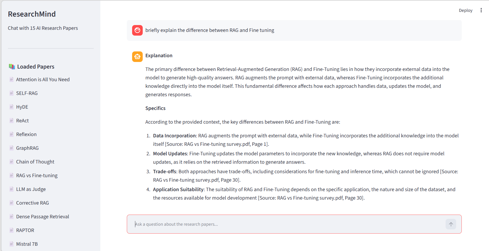

# ResearchMind — Chat with AI Research Papers

A production-grade **Corrective RAG (CRAG)** application that lets you have multi-turn conversations with AI research papers using a self-correcting agentic pipeline built with LangGraph. Entirely free and open source — no paid APIs required.

# Demo



---

##  What This Project Does

Upload any collection of PDF research papers and ask questions in natural language. 
ResearchMind:
- Rewrites your question for better semantic search
- Retrieves the most relevant chunks from 15 AI research papers
- Grades retrieved chunks for relevance — falls back to web search if needed
- Generates a grounded answer with paper name and page number citations
- Checks its own answer for hallucinations before responding
- Remembers conversation history for natural multi-turn chat

---

##  Architecture
```text
User Question
     ↓
[Node 1] Query Rewriter
     Rewrites vague questions into detailed search queries
     ↓
[Node 2] Retriever
     Fetches top 5 semantically similar chunks from ChromaDB
     ↓
[Node 3] Relevance Grader
     LLM grades each chunk — filters irrelevant ones
     ↓                    ↓
[Relevant]          [Not Relevant]
     ↓                    ↓
     ↓             [Node 4] Web Fallback
     ↓              DuckDuckGo search as backup
     ↓                    ↓
[Node 5] Answer Generator
     Groq Llama 3.3 70B generates cited answer
     ↓
[Node 6] Hallucination Checker
     Verifies every claim is grounded in retrieved context
     ↓                    ↓
[Grounded]          [Not Grounded]
     ↓                    ↓
   END              loops back to Answer Generator
     ↓
Final Answer + Source Citations
```
This pattern is called **Corrective RAG (CRAG)** — a well-known 
advanced RAG architecture that self-corrects retrieval before generation.

---

## Tech Stack

| Component | Tool | Why This Choice |
|---|---|---|
| LLM | Groq (Llama 3.3 70B) | Free tier, fast inference, fully open source |
| Embeddings | Ollama (nomic-embed-text) | Runs locally, zero API cost, no rate limits |
| Vector DB | ChromaDB | Zero setup, local persistence, metadata filtering |
| Agent Framework | LangGraph | Industry standard for agentic AI pipelines |
| PDF Parsing | PyMuPDF | Fast, accurate, preserves page metadata |
| Web Fallback | DuckDuckGo Search | Free, no API key required |
| UI | Streamlit | Rapid prototyping, clean chat interface |
| Evaluation | Custom + DeepEval | Faithfulness, relevancy, precision, recall |

**100% free and open source. Zero API costs.**

---

## Getting Started

### Prerequisites

- Python 3.10+
- [Ollama](https://ollama.com) installed and running
- [Groq API key](https://console.groq.com) (free, no credit card)
- Git

### Installation

**1. Clone the repository:**
```bash
git clone https://github.com/Vedhikanarasiman/researchmind.git
cd researchmind

2. Create and activate virtual environment:
# Windows
python -m venv venv
venv\Scripts\activate

# Mac/Linux
python -m venv venv
source venv/bin/activate

3. Install dependencies:
pip install -r requirements.txt

4. Pull the embedding model:
ollama pull nomic-embed-text

5. Create your .env file:
# Create a file called .env in the root folder with:
GROQ_API_KEY=your_groq_api_key_here

6. Add your research papers:
Drop PDF files into the data/papers/ folder

7. Run the ingestion pipeline (one time only):
python ingest.py

8. Launch the application:
streamlit run app.py

Open your browser at http://localhost:8501


** Project Structure **

researchmind/
├── data/
│   └── papers/              # Add your PDF papers here
├── src/
│   ├── ingestion/
│   │   ├── __init__.py
│   │   ├── loader.py        # PDF loading with PyMuPDF (page by page)
│   │   └── chunker.py       # Text chunking with 500 token chunks, 50 overlap
│   ├── embeddings/
│   │   ├── __init__.py
│   │   └── embedder.py      # Ollama nomic-embed-text + ChromaDB storage
│   ├── retrieval/
│   │   ├── __init__.py
│   │   └── retriever.py     # Cosine similarity search, top-k retrieval
│   ├── graph/
│   │   ├── __init__.py
│   │   ├── state.py         # LangGraph TypedDict state definition
│   │   ├── nodes.py         # All 6 CRAG node functions
│   │   └── graph.py         # StateGraph assembly + MemorySaver
│   └── utils/
│       ├── __init__.py
│       └── helpers.py
├── assets/
│   └── demo.png             # UI screenshot for README
├── app.py                   # Streamlit chat UI
├── ingest.py                # One-time PDF ingestion script
├── evaluate.py              # Custom LLM-as-Judge evaluation
├── evaluate_deepeval.py     # DeepEval framework evaluation
├── requirements.txt         # Dependencies
├── .gitignore
├── README.md
└── .env                     # API keys 


## Key Concepts Implemented

1. Corrective RAG (CRAG) — Self-correcting retrieval with relevance grading
2. LangGraph StateGraph — Nodes, edges, conditional routing, entry points
3. Conversation Memory — LangGraph MemorySaver for multi-turn chat
4. Hallucination Detection — LLM-as-Judge with retry loop (max 2 retries)
5. Query Rewriting — Improves semantic search quality before retrieval
6. Relevance Grading — Filters irrelevant chunks before generation
7. Web Fallback — DuckDuckGo search when ChromaDB has no relevant chunks
8. Source Citations — Every answer cites paper name and page number
9. RAG Evaluation — Custom metrics + DeepEval industry framework
10. Dependency Pinning — All packages pinned in requirements.txt for reproducibility
11. Token Budget Management — Retry limits prevent infinite loops and excess API usage

## Limitations

- Evaluation uses LLM-as-Judge which has inherent subjectivity
- ChromaDB is not production-scale
- Groq free tier has daily token limits

## Research Papers Indexed

15 foundational AI/ML papers across RAG, agents, and transformers:

1. Attention is All You Need — Transformer architecture
2. SELF-RAG — Self-reflective retrieval
3. HyDE — Hypothetical document embeddings
4. ReAct — Reasoning + acting agents
5. Reflexion — Agent self-correction
6. GraphRAG — Graph-based retrieval
7. Chain of Thought Prompting — Reasoning in LLMs
8. RAG vs Fine-tuning Survey — Comparison study
9. LLM as Judge — LLM evaluation
10. Corrective RAG — CRAG architecture
11. Dense Passage Retrieval — DPR retrieval
12. RAPTOR — Recursive RAG
13. Mistral 7B — Open source LLM
14. LLM Agents Survey — Agent landscape
15. LangGraph Agent — Agentic framework

**Ingestion Stats:**
- 15 PDFs processed
- 501 pages loaded
- 4,090 chunks created and indexed
- 768-dimensional vectors stored in ChromaDB